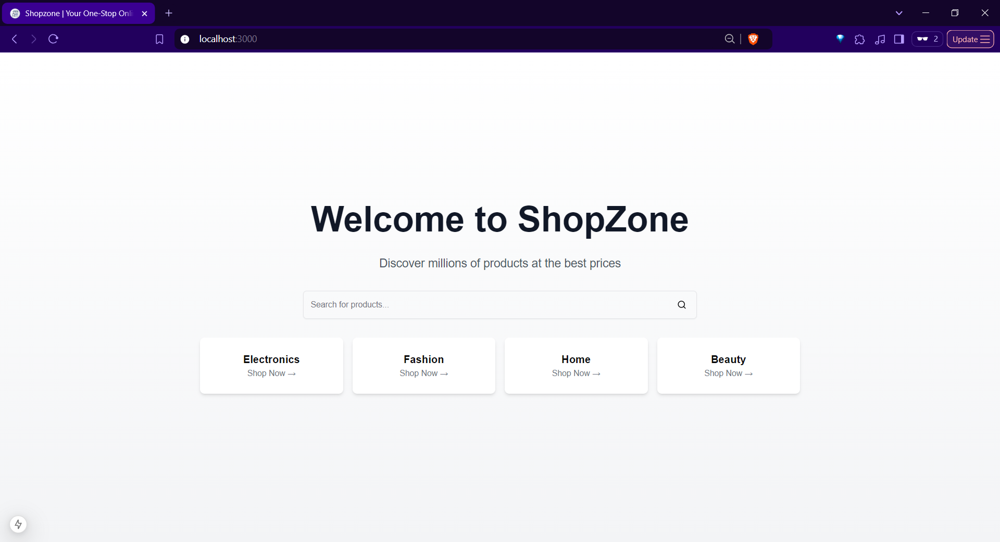
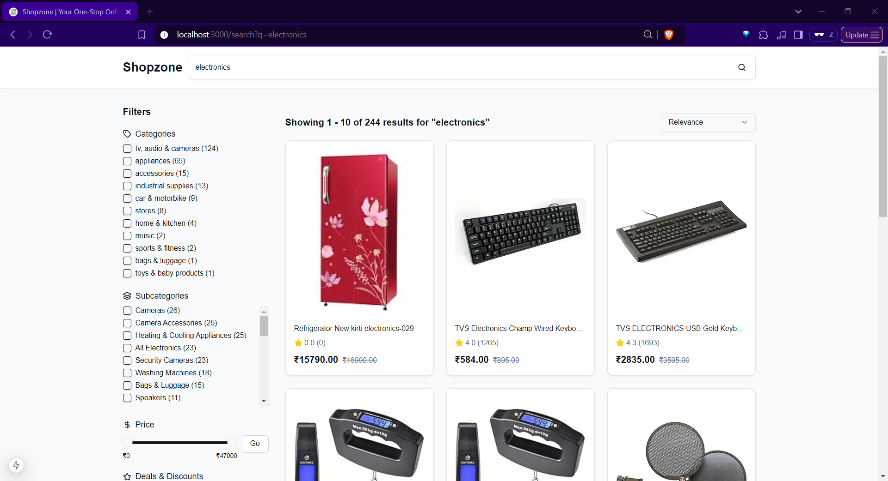
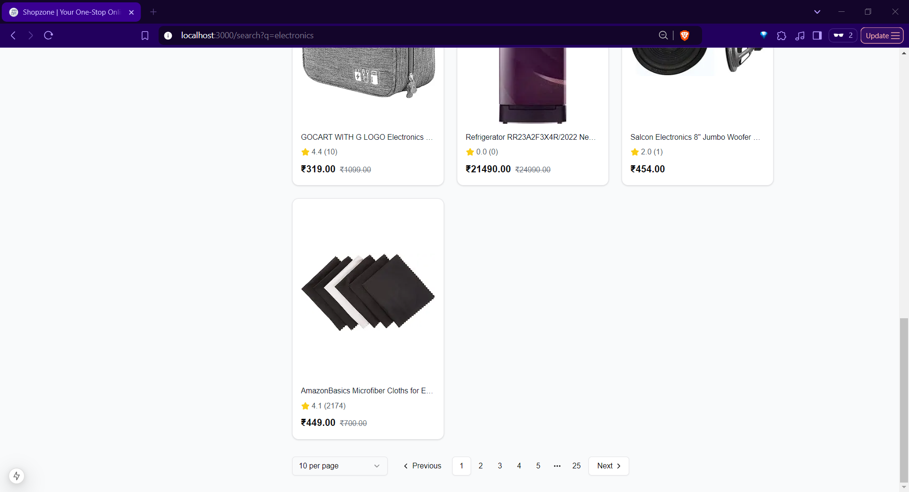
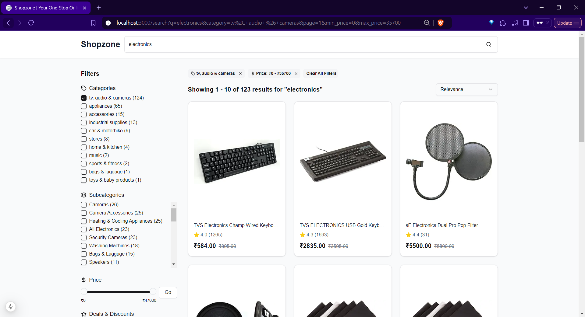
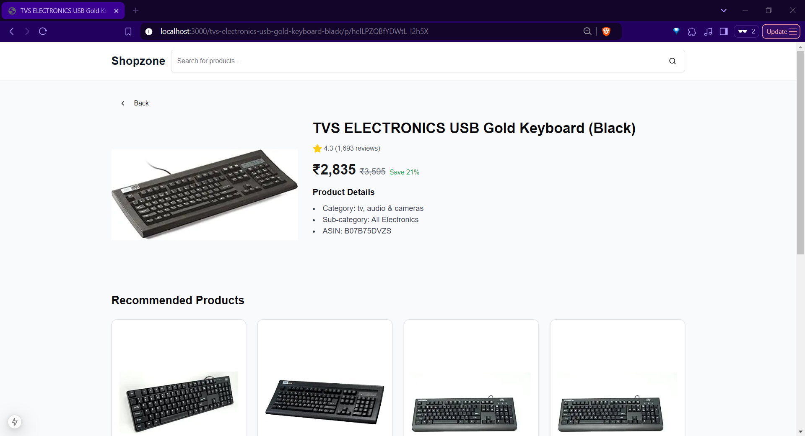
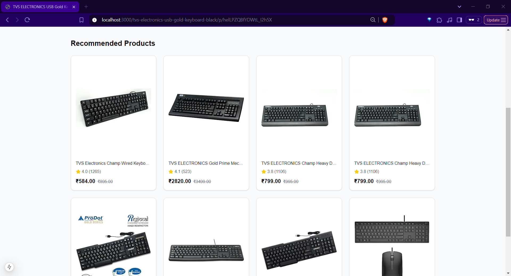
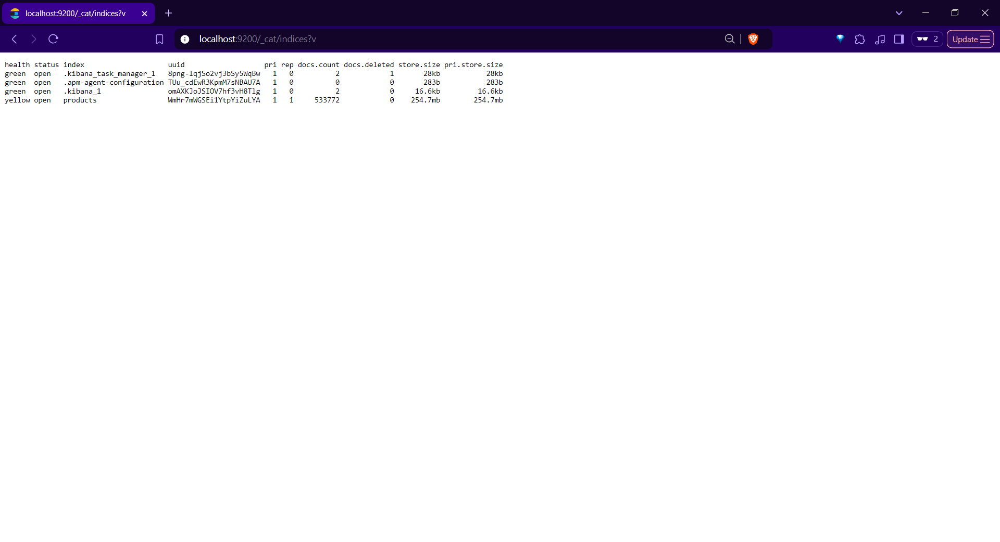
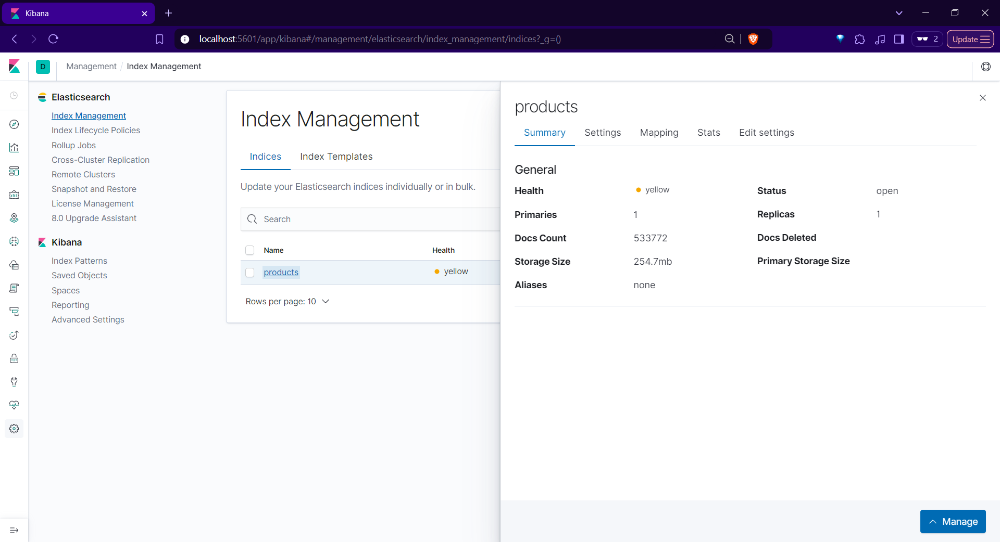

# ShopZone

A full stack e-commerce application built with Next.js, FastAPI and Elasticsearch. It provides a seamless shopping experience with powerful search capabilities, sorting, filtering and an intuitive interface. The application is fully responsive and mobile-friendly, offering a consistent experience across all devices. 

## Features

- Real-time product search with Elasticsearch
- Advanced filtering and sorting options
- Responsive design that works on mobile, tablet and desktop
- Clean and modern UI built with TailwindCSS and Radix UI
- Fast and optimized performance
- RESTful API backend with FastAPI
- Containerized deployment with Docker

## Tech Stack
- Next.js
- TypeScript
- TailwindCSS
- Radix UI
- FastAPI
- Elasticsearch
- Kibana
- Docker
- Docker Compose
- Python

## Installation

1. Clone the repository
2. Run `docker compose -f docker-compose-production.yml up` to start the elasticsearch, kibana, backend and frontend instances
3. Run `docker compose -f docker-compose-production.yml down` to stop the elasticsearch, kibana, backend and frontend instances
4. Run `docker compose -f docker-compose-production.yml up --build` to build and start the elasticsearch, kibana, backend and frontend instances
5. On first run, the backend will seed the data into the elasticsearch index. This may take a few minutes. Please be patient and do not close the terminal.
6. Frontend will be available at `http://localhost:3000/`
7. Backend will be available at `http://localhost:8081/`
8. Kibana will be available at `http://localhost:5601/`
9. Elasticsearch will be available at `http://localhost:9200/`

## Media

### Landing Page

### Search Page

### Search Page Pagination

### Search Page With Filters

### Product Details Page

### Product Recommendations

### Elasticsearch server

### Kibana server

## License
Copyright (c) 2024 Y. Siva Sai Krishna

This project is licensed under the AGPL-3.0 License - see the LICENSE file for details.
